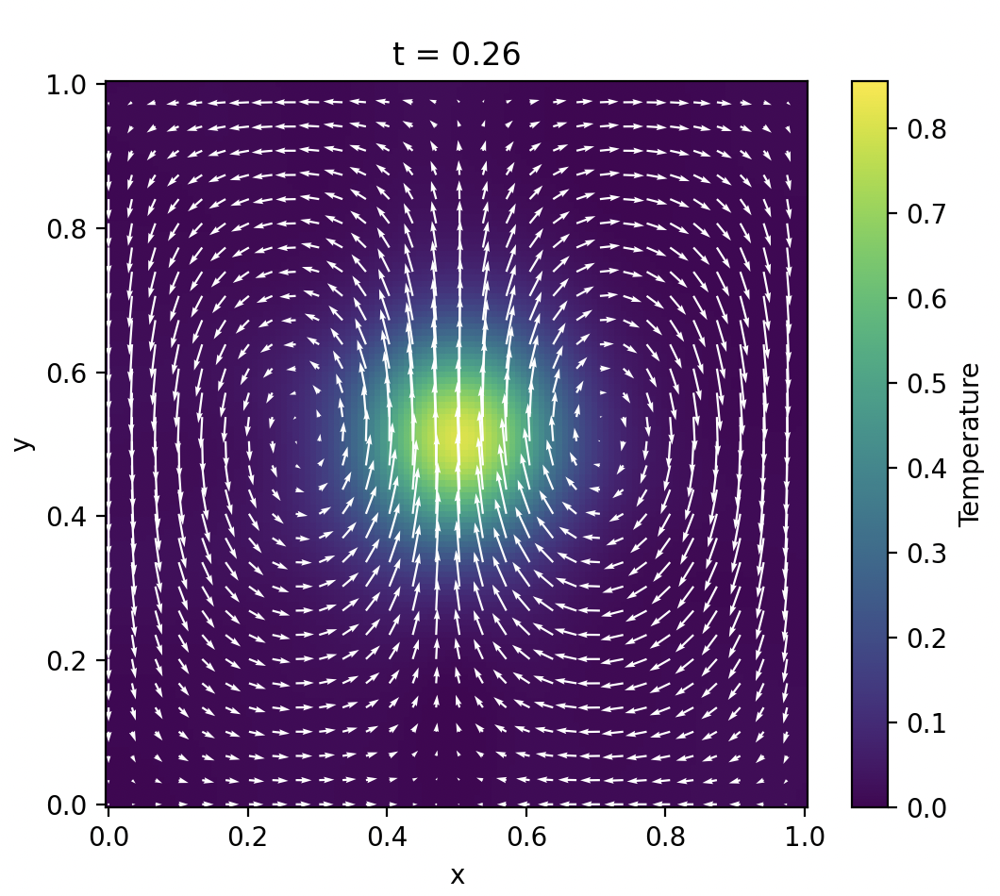

# pde-physics-informed-neural-networks

The following repository contains scripts for solving and validating the Navier-Stokes equations using physics-informed neural networks with PyTorch.

## Results

## Contents
[pinn_navier_stokes_equations.py](#pinn_navier_stokes_equations.py)  

