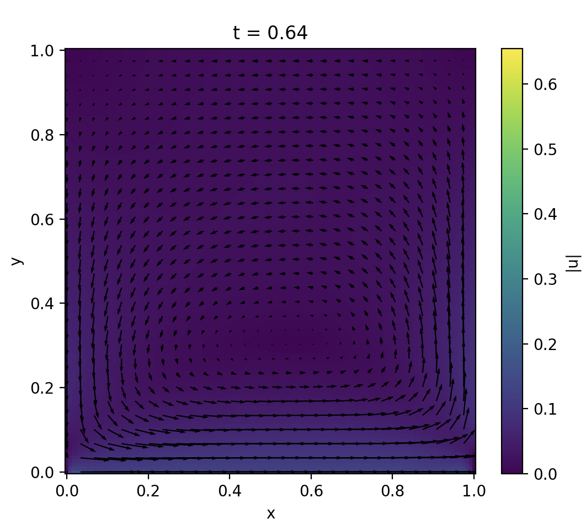

# pde-physics-informed-neural-networks

The following repository contains scripts for solving and validating the Navier-Stokes equations using physics-informed neural networks with PyTorch. Each .py file contains a thorough summary of the script and problem statement.

## Results

## Contents
[pinn_navier_stokes_equations.py](#pinn_navier_stokes_equations.py)  
[pinn_navier_stokes_convection.py](#pinn_navier_stokes_convection.py)  

